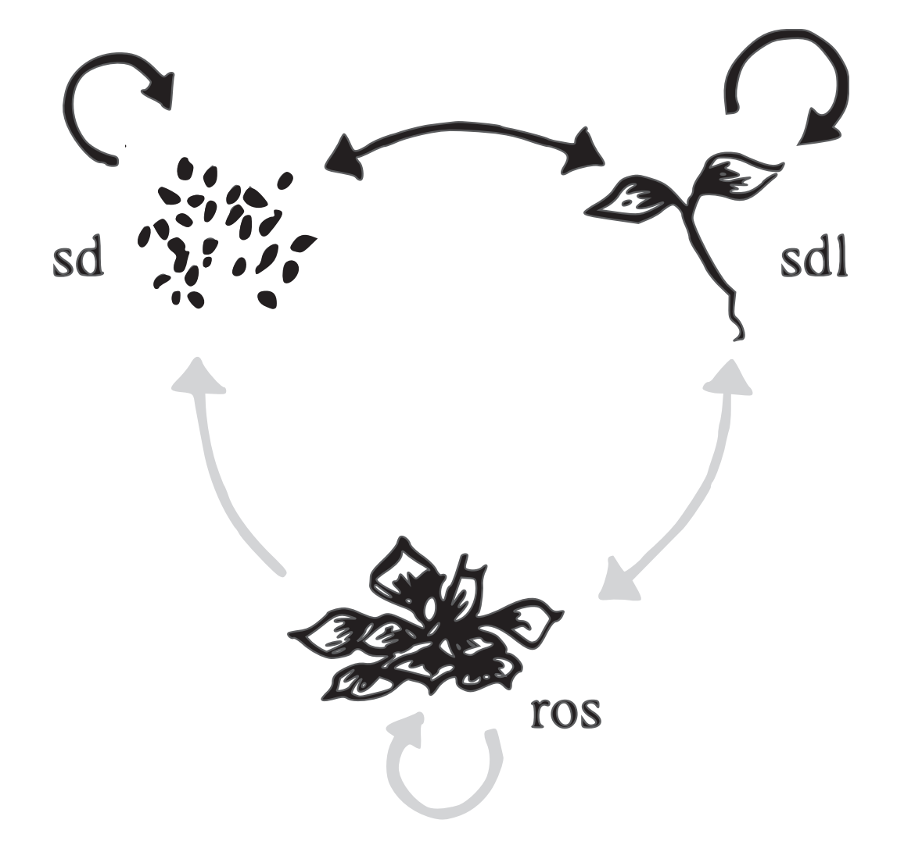

# Introduction {#intro}

**Polyploidy** arises via mechanisms of genome-doubling (such as non-disjunction) and describes organisms with more than two sets of chromosomes. No polyploid mammal or bird species have been found, as the condition appears to be fatal in these classes [@Svartman2005; @Wertheim2013]. However, polyploidy has been observed in amphibians, fish, fungi, reptiles, and plants. Amongst these, genome-doubling is exceptionally well tolerated in plants; polyploidy a ubiquitous feature in the lineages of almost all flowering plants (angiosperms) and has occurred even more recently (post genera formation) for 35% of all vascular plants [@Jiao2011; @Wood2009]. Linked, both with speciation and major innovation, this extreme mutation that readily doubles the genomes of plants has been the topic of much research as well as hot debate; why do polyploid lineages evolve and persist? A modelling approach will be used, here, to elucidate some of the main mechanisms at play in this system. To get to the bottom of how polyploidy evolves, a sound understanding of the costs and benefits of being polyploid must first be grasped, as well as some of the terminology surrounding plant mating systems and polyploid types. Looking at how polyploids are formed will orientate the reader to the specific terminology, and lead into the background on the inherent costs of becoming polyploid (**pollen-swamping** and **triploid sterility**). Precisely what these costs are, and how they interact to create reproductive isolation, will be covered in order to ask how strong the negative selection they create together really is.

## The role of genome-doubling in plant diversification  {#intro-diversification}

Polyploidisation events in plant lineages are ubiquitous, apparently making genome-doubling fundamental in the diversification of plants. Furthermore, polyploidisation coincides with speciation 15% of the time in angiosperms and 31% in ferns [@Wood2009] and has even been linked with major biological innovations that led to the diversification of the seed plant (spermatophyte) and angiosperm phyla [@Jiao2011]. Seeds and flowers were both crucial innovations that allowed plants to transition from an aquatic life-cycle to a terrestrial one by removing their dependence on water for reproduction. These adaptations are broadly considered as two of the most significant in the history of our planet, as they enabled the 'greening' of earth. No wonder, then, that there has been a substantial effort made towards understanding the evolution of polyploidy and the mechanisms by which genome-doubling has been able to drive such adaptations. As a result, polyploidisation has been shown to drastically alter phenotypes, breeding system, and physiology within just a few generations due to the massive genomic alterations that newly created polyploids (**neopolyploids**) rapidly undergo [@Adams2005; @Levin2002; @Soltis2014a]. Polyploids often also have larger flowers, seeds and stomata as well as being more robust all-round [@Ramsey2002]. Because of these attributes, genome-doubling has been crucial in the domestication of many crop plants, for instance; wheat, maize, sugarcane, coffee, cotton and tobacco [@Dubcovsky2007; @Otto2000]. However, these same beneficial traits are also linked with the invasive potential of plants [@TeBeest2012].

Despite being broadly considered as one of the main driving forces in angiosperm evolution [@Barker2016; @Otto2007; @Soltis2014a], however, polyploids may contribute far less to diversification than their diploid counterparts [@Mayrose2011]. While genome-doubling significantly increases speciation rates of diploids, new polyploid lines do not appear to speciate further by that same mechanism and so speciate at a slower rate. Furthermore, polyploid extinction rates are far higher than those of diploids which further reduces their overall speciation rate relative to diploids [@Arrigo2012; @Mayrose2011]. While the validity of these findings has been the topic of some debate [@Mayrose2015; @Soltis2014], they represent a current shift in opinion; away from the view of polyploidy driving speciation and back to the formerly popular idea that polyploidy most often leads to evolutionary 'dead ends' [@Stebbins1950]. 

## Polyploid formation in angiosperms

There are multiple routes to producing polyploid offspring as **genome-doubling** occurs either intraspecifically (**auto**polyploidy) or via merging of genomes during hybridisation (**allo**polyploidy). The relative abundance and rates of the appearance of each type have long been debated [@Darlington1937; @Stebbins1947], but improved methods of determining ploidy levels (flow cytometry) have led to a much clearer understanding of this topic in recent years as both cytological and genetic data have accumulated [@Dolezel2007]. In the past, autopolyploids were not recognised as distinct species. They were categorised, instead, as cytotypes of their progenitors, leading to a gross underestimation of their prevalence [@Soltis2007]. Both the rates of genome-doubling and the mechanisms by which it occurs are different in autopolyploids and allopolyploids [@Ramsey1998]. Therefore, it is important to draw this distinction between them in order that the modelling can adequately reflect the system. 

The focus herein is on autopolyploid formation which occurs via the following routes: 1) polyspermy, where ova are fertilised by multiple pollen grains; 2) somatic-doubling, which can produce entire polyploid shoots or polyploid seeds, always of even ploidy number; 3) meiotic nuclear restitution which causes uniparental genome loss (significant in hybridisation); 4) **gametic-nonreduction**, where aberrations in spindle function and cytokinesis cause errors during meiosis that produces unreduced gametes (i.e.:- diploid rather than haploid). Of these mechanisms, the production of unreduced gametes is the most common pathway to polyploidy, and the most is known about the rates of polyploidisation via this route [@Ramsey1998]. With this in mind, gametic-nonreduction is the form of genome-doubling that this thesis will focus upon. 

The nonreduction of gametes produces individuals of varying ploidy level with both odd and even-numbered sets of chromosomes. Consider a diploid population; under usual circumstances gametes produced would be haploid and F1 offspring, therefore, would be diploid just like their parents. However, when nonreduction occurs, and diploid gametes enter the system, now there will be fertilisation attempts between haploid and diploid gametes, or diploid and diploid gametes as well. As a result, offspring ploidy can range from two to four, and the population is now made up of parental diploids, as well as F1 diploids, triploids, and tetraploids. In the generation that follows (F2), ploidy level gets even more diverse due to further nonreduction and increased interploidy pairing of gametes (see figure \ref{fig:intro-polyploid-formation}). 

## Pollen-swamping and triploid sterility {#intro-pollen-swamping}

Neopolyploids are thought to suffer rapid reproductive isolation via post-zygotic barriers that produce sterile or inviable offspring; triploids, and other odd-numbered ploidy levelled individuals, are often sterile due to developmental defects, genomic instability, a lack of endosperm that reduces seed viability, and problems with gametogenesis that produces inviable pollen [@Costa2014; @Sonnleitner2013]. The following explanation of **pollen-swamping** is best digested alongside figure \ref{fig:intro-polyploid-formation} which visualises the gametic interactions that lead to the production of both sterile and viable polyploids. Diploids (or 2x individuals) produce mostly haploid gametes (or 1n gametes). Diploid gametes (2n) produced via nonreduction occur at a much lower frequency; less than six-in-a-thousand for non-hybrids [@Ramsey1998]. Because of this abundance of haploid gametes, the frequency of F1 diploid offspring (2x) is highest, followed by sterile triploids (3x), with viable tetraploids (4x) appearing at the lowest frequencies. Most unreduced female gametes that appear find themselves *swamped* by the pollen of diploids and only those that are found by similarly unreduced pollen can be successful in increasing the fitness of either diploid progenitor.

Sticking with figure \ref{fig:intro-polyploid-formation}; when reproduction of F1 individuals occurs the chances of producing viable offspring increases, but only minorly. Most of the gametes produced are still haploid (1n), with nonreduction creating 2n gametes like before. There are also now some F1 tetraploids (4x) in the system; they produce 2n gametes under usual circumstances and unreduced 4n gametes at a lower rate. The increase in 2n gametes produced by F1 individuals increases the probability that tetraploids will be produced in F2. Additionally, 2n and 4n gametes produced can combine to create viable hexaploids. However, the majority of F1 gametes in the system are still haploid. Male 1n gametes swamp female gametes of all levels (1n through to 4n), blocking access to other ploidy type pollen so that the majority of offspring produced are sterile triploids (3x) and pentaploids (5x). 

Pollen-swamping, therefore, refers to the fitness deficit created by the overloading of female reproductive organs with incompatible pollen (typically haploid pollen created by diploids) which is usually most abundant in an angiosperm system. An example of this process in action has been observed in Spain, where the species distribution of a mixed diploid-hexaploid population of *Mercurialis annua* was disrupted. The diploids there gained such a competitive advantage by swamping neighbouring hexaploid populations with their pollen, that they displaced the hexaploids in multiple regions [@Buggs2006]. Exactly how strongly pollen-swamping selects against polyploidy, however, is not well known as pollination is difficult to measure in the wild. Finding out exactly how costly pollen-swamping is would help to disentangle how the adaptation of beneficial traits in polyploid lineages might allow them to overcome that cost in order to persist and become established. In other words, where is the bar that these traits need to reach in order to become beneficial? 

## The heart of the matter

Given the body of evidence that touts their rapid adaptability, why are so many neopolyploid lines doomed to extinction? Furthermore, under what conditions does polyploidy become advantageous and succeed so that these lineages become established and persist? A population is considered to have become established when the probability of extinction becomes unlikely. Therefore, the establishment phase is a critical period where any new plant population is at higher risk—as such, understanding the cost-benefit mechanisms for any neopolyploid is vital to predicting its chance of survival. The discussion surrounding the advantages and disadvantages of polyploidy is well-reviewed in @Comai2005, @Ramsey2014, and @Otto2007. However, even after a century of research, the factors that drive the success of polyploid establishment in the face of high extinction rates are still unclear. 

Previous models offer contradictory predictions about how important the the rate of nonreduction is to polyploid establishment; mathmatical models support the idea that it must be unrealistically high and adaptation is required [@Felber1991; @Rausch2005], while a more recent, complex individual-based model showed that polyploids needed no adaptation and that natural rates of nonreduction were sufficient for establishment [@Oswald2011]. The full picture is still not clear.

Theoretically, if the rate of nonreduction were increased so more 2n gametes were in the mating pool that creates F1 offspring (refer again to figure \ref{fig:intro-polyploid-formation}), then the strength of pollen-swamping should be reduced; more 2n gametes will mean more 2n + 2n fertilisation attempts and, therefore, more 4x offspring to balance out the sterile F1 triploids produced. Could modelling a system where the rate of nonreduction is artificially increased, show us how strong the negative selection created by pollen-swamping really is? How high would the frequency of parental 2n gametes need to be in order for polyploids to gain a reproductive advantage over diploids in the system?

## Aims {#intro-aims}

Using an individual-based modelling approach, I will investigate the response of relative polyploid and diploid frequencies to changes in the rate of genome-doubling via nonreduction. The model will attempt to elucidate whether increasing the frequency of unreduced gametes in an angiosperm system will give the polyploids which evolve an advantage significant enough to overcome the cost of pollen-swamping and triploid sterility. As such, the model will run under the assumption that all odd-numbered ploidy individuals (for example, triploids and pentaploids) are sterile. Neopolyploid fitness will, therefore, be negatively impacted due to the interplay between the abundance of haploid pollen and this 'triploid' sterility. I aim to quantify the theoretical cost of pollen-swamping by testing how high the rate of nonreduction would need to be in order to overcome the strength of negative selection which it creates. I ask: 

1. **What frequency of sterile polyploids will arise in relation to the rate of nonreduction?** For F1 offspring, while the frequency of unreduced gametes is far less than that of haploid gametes, the probability of producing sterile offspring should be equal to, or just below, the rate of nonreduction; because every unreduced gamete is most likely to be paired with a haploid one. However, as generations continue and viable polyploids appear, the number of unreduced gametes (2n and above) also increases. Will this increase or decrease the frequency of sterile polyploids present in the system? 
2. **Can the frequency of viable polyploid adults in the total population exceed half the rate of nonreduction?** For every unreduced gamete created, the probability of a viable polyploid being produced increases. The rate of nonreduction and polyploid frequency are, therefore, intrinsically linked. The maximum frequency of viable F1 polyploid offspring is half of the rate of nonreduction and can only occur if all unreduced male gametes are matched with unreduced female gametes. Therefore, if the frequency of viable polyploids in the system can exceed half the rate of nonreduction, the unreduced gametes in the system have begun to escape the adverse effects of pollen swamping.
3. **Will increasing the rate of nonreduction lead to the fixation of polyploidy?** If the unreduced gametes can begin to escape the effects of pollen-swamping, it follows that the evolving polyploid population should have a chance, then, to outcompete their diploid progenitors. 
4. **Do established and pioneering populations respond in the same way to increased rates of nonreduction?** Pioneering populations of diploids with only small numbers of individuals may be more susceptible to extinction than more established populations. It's possible there is a density-dependent response to increased nonreduction rates. Increased rates in a small populaltion should have a larger and more rapid outcome than the same rate in a larger population; the population size should buffer against the increased rate and allow more wiggle room in population frequency during stabilisation without being at risk of extinction.

## The study system {#intro-study-system}

The model that follows was designed to simulate the life cycle of the yellow monkeyflower *Erythranthe gutatta* (previously: *Mimulus guttatus*) as laid out by @Peterson2016 and detailed in figure \ref{fig:intro-life-cycle}. *E. guttata* is a widespread, polymorphic herb that is found in a diverse range of habitats [@Wu2008]. Because ancient and recent genome-doubling is well documented in the species complex of this popular study organism [@Beardsley2004; @Buggs2012; @Simon-Porcar2017], *E guttata* was a sensible choice for parameterising the model that follows. Yellow monkeyflowers can be annual or perennial, and figure \ref{fig:intro-life-cycle} distinguishes between these modes by using grey arrows for the transitions that only perennials make, to form cloned rosettes (ros) via stolons. The project aims do not require the representation of rosettes in the model. The questions which it hopes to answer are specifically about how the patterns of polyploid evolution change in response to mechanisms of sexual reproduction. Therefore, only the seed (sd) and seedling (sdl) life stages from the life-cycle graph (figure \ref{fig:intro-life-cycle}) will be included. @Peterson2016 have termed the reproductive life stage of the annuals as seedlings, but this seems confusing, so from here in they will be referred to as 'adults'.

```{r polyploid-formation, out.width="100%", dpi=300, fig.align="center", fig.cap="\\label{fig:intro-polyploid-formation}\\textbf{Polyploid formation via gametic nonreduction and pollen-swamping:} Base ploidy level (number of sets of chromosomes) of individual plants (cirlces) is denoted 2x (diploid), 3x (tetraploid) and so on. Ploidy level of gametes (diamonds) is denoted with 1n (haploid), 2n (diploid) and so on. Blue arrows show genome-doubling occuring via nonreduction of gametes. Red arrows show the route by which haploid pollen swamps the gametes of polyploids to produce inviable offspring. Fat lines and borders indicate a higher frequency of occurance."}
knitr::include_graphics("_images/polyploid-formation.pdf")
```

```{r life-cycle, out.width="70%", dpi=300, fig.align="center", fig.cap="\\label{fig:intro-life-cycle}\\textbf{Life cycle} of \\textit{Erythranthe guttata} (previously: \\textit{Mimulus guttatus}) taken from \\cite{Peterson2016}. Seedlings (sdl) and rosettes (ros) are both sexually reproductive flowering stages which produce seeds (sd). Annual populations follow the black arrows, whereas perennials also follow grey arrows to form rosettes (asexually produced clones)."}

```
