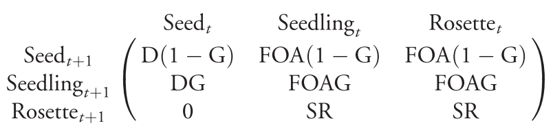

# Methods {#methods}

An Individual-based model was created, from scratch, in *R v3.6.1* [@R-base], as an open-source R package *sploidy v.0.2.1* [@R-sploidy], and is available along with scripts and data on [Github](https://github.com/rosemckeon/honours-project). In order to test the hypotheses presented, reproductive isolation of polyploids had to occur in a way that represented the production of sterile offspring via pollen swamping.

## Model flow

From a starting population of seeds and adults, transition probabilities, seed survival probability, and germination rates were used to transition individuals through time, continuously from time *t* to time *t + 1* (see figure \ref{fig:methods-model-flow} for a diagram of the model flow). Surviving seeds in time *t* either germinated to become adults in time *t + 1* or they remained as seeds. Seed dormancy was limited by a longevity parameter that reduced the seed bank before survival probabilities were applied. Adults in time *t* became the mating pool for separate transitions involving reproduction, either to seed or straight to new adults in time *t + 1*. During reproduction (figure \ref{fig:methods-reproduction}), sterile adults were ignored, and mothers were sampled first from the adult population. Pollen donors were paired with mothers so that every mother received pollen; sampling was done with replacement, so some plants pollinated multiple mothers while others did not pollinate any. Once all fertilisation attempts were decided, gametic nonreduction occurred at a specified rate, separately to both female and male gametes. The ploidy level of paired gametes was then used to calculate the base ploidy level of the new seed. Those that germinated became adults in time *t + 1*, while those that did not remained as seeds. Once all the transitions were complete, carrying capacity limited any possible exponential growth by randomly selecting survivors from across the entire landscape, and the cycle repeated (figure \ref{fig:methods-model-flow}).

## Experiment design {#methods-experiment-design}

The simulations began with a cohort of diploid individuals that underwent gametic nonreduction; a scenario which loosely reflected the neo-autopolyploidisation recently discovered to be responsible for a mixed diploid-tetraploid population of *E. guttata* in the Shetland Isles [@Simon-Porcar2017]. Transition probabilities remained the same for all simulations (see below), but the rate of nonreduction and the starting population size was varied. Control simulations, without nonreduction, used 100 random starting population sizes between 1 and the carrying capacity of the landscape (K = 100000). Experimental simulations, with nonreduction, used another 1000 random starting population sizes in the same range (1:100000), as well as 1000 random rates of nonreduction between 0 and 0.5. This upper limit was chosen because once more than half of the gametes in the system are unreduced, they will become the most abundant type. Pollen-swamping, therefore, should no longer be in effect—it was not interesting to see if polyploids could evolve when the odds were stacked in their favour with a nonreduction rate above 0.5.

## Transition data {#methods-model-sims-trans}

Data for an *E. guttata* population that had stable properties and no clonal growth were used. The data (table \ref{tab:methods-trans-values}) and formula (figure \ref{fig:methods-trans-formula}) used to calculate transitions (table \ref{tab:methods-trans-matrix}) was taken from @Peterson2016. The population chosen was a low-elevation perennial from a year when no rosettes were produced, so the life-stages match those modelled (seeds and adults). Data existed for the same population in another year when rosettes did occur, so by choosing this population, there was room to build upon the results presented here at a later date.

## Assumptions {#methods-model-assumptions}

- All individuals began as diploid.
- Polyploids arose by chance depending on the rate of nonreduction during all sexually reproductive transitions. The frequency of polyploids that appeared was an emergent property of the interactions between adult gametes which were first sampled randomly, before being paired, and then reduced or left unreduced (see figure \ref{fig:methods-reproduction}).
- Even-numbered ploidy individuals were viable and could outcross or self-fertilise.
- Odd-numbered ploidy individuals were sterile and did not contribute to transitions.
- Pollen range spanned the entire landscape.
- All plants were hermaphrodite (in possession of perfect flowers that provided both male and female function), as is most common for *E. guttata* [@Wise2011] and, indeed, all angiosperms; mothers and fathers were chosen via random sampling from the same pool of individuals.
- Seed dispersal spanned the entire landscape.
- Seed dormancy was disabled to remove any lag in the effects of changing the rate of nonreduction; this fit with the lack of dormancy described for *E. guttata* [@Willis1993].
- Carrying capacity limited any exponential population growth that resulted in adult poulation sizes over 100000.

```{r model-flow, out.width="100%", dpi=300, fig.align="center", fig.cap="\\label{fig:methods-model-flow} \\textbf{Model flow:} From a starting population of diploid seeds and adults (A), transitions involving survival, reproduction and germination probabilities occur (B) to create the individuals present in the next generation (C). This process loops continuously from time \\textit{t} to time \\textit{t plus 1} to simulate the life cycle of \\textit{E. gutta}. Carrying capacity limits any possible exponential growth by randomly selecting survivors across the entire landscape at the end of every generation (D). In addition, where seed survival probabilities would lead to generation fo a seed bank, the size of this is limited with an enforced maximum longevity before seed survival is applied a the beginning of a new generation (E). Transitions (B) highlighted in red are where the mechanisms of genome-doubling and pollen-swamping occur (for more details see figure \\ref{fig:methods-reproduction})."}
knitr::include_graphics("_images/model-flow.pdf")
```

```{r reproduction, out.width="100%", dpi=300, fig.align="center", fig.cap="\\label{fig:methods-reproduction}\\textbf{Reproduction and germination:} For all transitions from adults in time \\textbf{t} (A) to seeds or adults in time \\textbf{t + 1} (D), individuals must go through reproduction (B) and germination (C). Mechanisms of reproduction which induce the effects of pollen-swamping (E) and triploid sterility (F) are highlighted in red, while the process that controls genome-doubling (G) is shown in blue."}
knitr::include_graphics("_images/reproduction.pdf")
```


```{r trans-formula, out.width="70%", dpi=300, fig.align="center", fig.cap="\\label{fig:methods-trans-formula}How the transition matrix (table \\ref{tab:methods-trans-matrix}, seedlings renamed as adults) was calculated from the data provided in table \\ref{tab:methods-trans-values}, according to this formula taken from \\cite{Peterson2016}."}

```

```{r trans-values, echo=FALSE}
readRDS("_data/mimulus.rds") %>%
  dplyr::filter(year == 2013) %>% 
  dplyr::select(-matrix, -group, -year, -n) %>%
  dplyr::mutate(A = signif(A, 3) %>% as.character()) %>%
  knitr::kable(
    "latex",
    caption = "\\label{tab:methods-trans-values}\\textbf{Components of transition:} values used to calculate the transition matrix of a low-elevation perennial population of \\textit{Erythranthe guttata} (previously: \\textit{Mimulus guttatus}) for a year in which no rosettes were produced. Seed survival (D) is not population specific; taken from \\cite{Elderd2006}. All other components taken from \\cite{Peterson2016} who recorded values specific to that \\textit{E. guttata} population in the year 2013 (N = 77). G = germination rate, O = ovule number per flower, F = flower production, S = winter survival, R = rosette production, A = proportional recruitment success of ovules relative to rosettes.",
    booktabs = T,
    digits = 3,
    escape = F
  ) %>% 
  kableExtra::kable_styling(
    full_width = T,
    font_size = 8
  )
```

```{r trans-matrix, echo=FALSE}
# get the matrix
trans <- readRDS("_data/mimulus.rds") %>%
  dplyr::filter(year == 2013) %>%
  pull(matrix) %>%
  magrittr::extract2(1)
# name the dimensions
stages <- c("Seed", "Adult", "Rosette")
dimnames(trans)[2] <- list(paste0(stages, " (t)"))
dimnames(trans)[1] <- list(paste0(stages, " (t+1)"))
# format the table for latex
trans %>%
  knitr::kable(
    "latex",
    caption = "\\label{tab:methods-trans-matrix}Transition matrix used for the model, based on the formula shown in figure \\ref{fig:methods-trans-formula} (adults were renamed from seedling) and the data from figure \\ref{tab:methods-trans-values}.",
    booktabs = T,
    row.names = T,
    digits = 3,
    escape = F
  ) %>% 
  kableExtra::kable_styling(
    full_width = T,
    font_size = 8
  )
```
